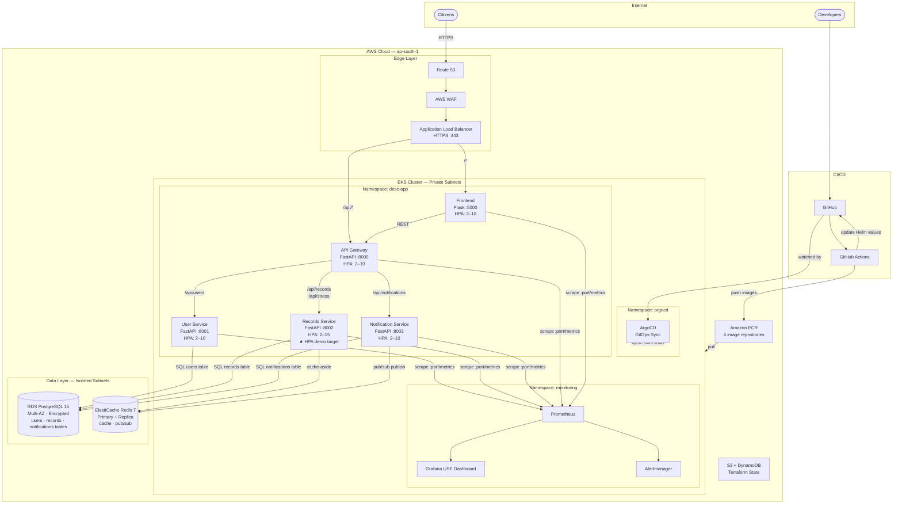

# High-Level Cloud Architecture

**Project:** DESC Digital Innovation Center — Cloud-Native Citizen Portal
**Reference:** DESC-MRD-2026-CNC-088

## Overview

A cloud-native, microservices-based citizen portal running on AWS EKS. The monolith has been decomposed into four independent backend services behind an API Gateway, each with its own horizontal autoscaler, Prometheus metrics endpoint, and independent database schema.

## Microservices Decomposition

| Service | Port | Responsibility | Data Store |
|---------|------|---------------|------------|
| Frontend | 5000 | HTML UI, proxies to Gateway | — |
| API Gateway | 8000 | Single entry point, routing, fan-out health | — |
| User Service | 8001 | Citizen user profiles (CRUD) | PostgreSQL `users` |
| Records Service | 8002 | Citizen records/applications, Redis cache, `/stress` HPA trigger | PostgreSQL `records` + Redis |
| Notification Service | 8003 | System announcements, Redis pub/sub publish | PostgreSQL `notifications` + Redis |

## Key Design Decisions

| Decision | Rationale |
|----------|-----------|
| API Gateway pattern | Single ALB target; microservices are internal-only (ClusterIP) — no service exposed directly to internet |
| Service isolation | User Service has no Redis dependency — demonstrates that each service only takes on the dependencies it needs |
| Records Service as HPA target | Stress endpoint (`/stress`) is CPU-bound (prime calculation) — makes auto-scaling visually demonstrable |
| Redis pub/sub in Notification Service | Demonstrates event-driven pattern — downstream consumers (e.g., WebSocket service) can subscribe to `desc:notifications` channel |
| Separate PostgreSQL schemas | All services share one RDS instance (cost-efficient demo) but each owns a distinct table — simulates separate database-per-service without extra RDS cost |
