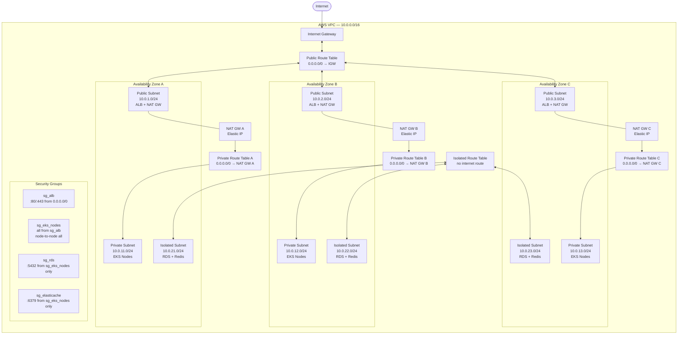
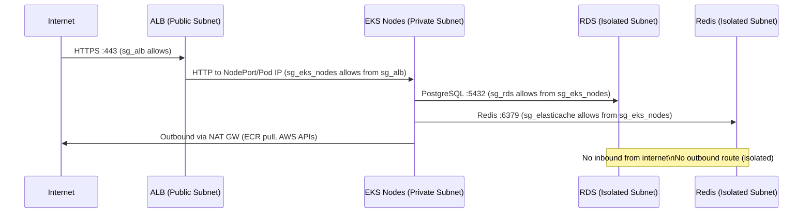

# Network & VPC Architecture

## CIDR Plan

| Resource | CIDR | Notes |
|----------|------|-------|
| VPC | `10.0.0.0/16` | 65,536 IPs total |
| Public Subnet AZ-a | `10.0.1.0/24` | ALB, NAT GW |
| Public Subnet AZ-b | `10.0.2.0/24` | ALB, NAT GW |
| Public Subnet AZ-c | `10.0.3.0/24` | ALB, NAT GW |
| Private Subnet AZ-a | `10.0.11.0/24` | EKS worker nodes |
| Private Subnet AZ-b | `10.0.12.0/24` | EKS worker nodes |
| Private Subnet AZ-c | `10.0.13.0/24` | EKS worker nodes |
| Isolated Subnet AZ-a | `10.0.21.0/24` | RDS, ElastiCache |
| Isolated Subnet AZ-b | `10.0.22.0/24` | RDS, ElastiCache |
| Isolated Subnet AZ-c | `10.0.23.0/24` | RDS, ElastiCache |

## Network Topology

## Traffic Flow Rules

## VPC Endpoints

To avoid NAT GW costs for AWS service calls:

| Endpoint | Type | Service |
|----------|------|---------|
| `com.amazonaws.*.s3` | Gateway | ECR layer pulls, S3 state |
| `com.amazonaws.*.ecr.api` | Interface | ECR API |
| `com.amazonaws.*.ecr.dkr` | Interface | ECR image pulls |
| `com.amazonaws.*.ec2` | Interface | EC2 API (Cluster Autoscaler) |
| `com.amazonaws.*.sts` | Interface | IRSA token exchange |

## Security Notes

- **No SSH** — SSM Session Manager used for node access (no bastion host)
- **VPC Flow Logs** — all traffic logged to S3 for audit
- **NACLs** — stateless layer; deny rules for known malicious CIDRs
- **Private EKS endpoint** — API server not reachable from internet; kubectl via VPN or SSM tunnel
