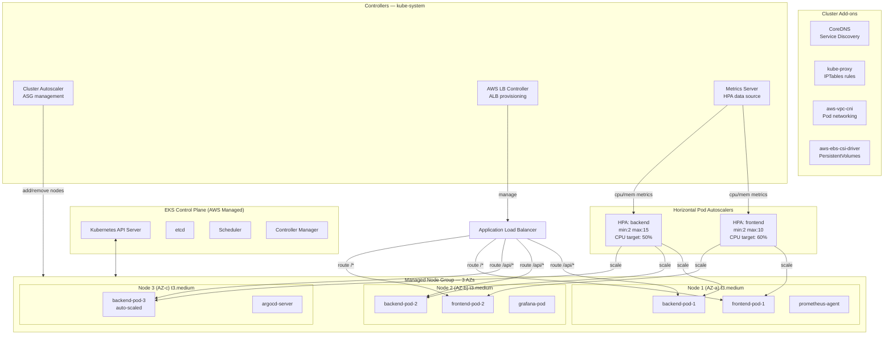
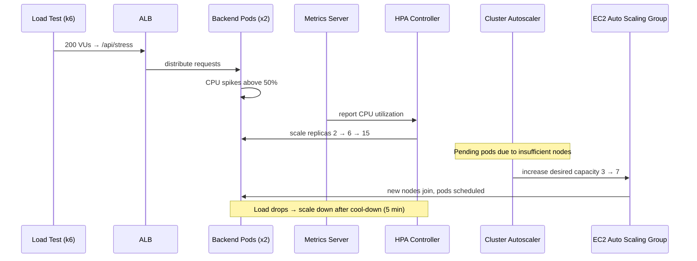

# EKS Cluster Architecture

## Cluster Overview

| Property | Value |
|----------|-------|
| EKS Version | 1.29 |
| Node Type | `t3.medium` (2 vCPU, 4 GiB RAM) |
| Min Nodes | 2 |
| Max Nodes | 10 |
| Desired Nodes | 3 |
| Endpoint | Private only |
| CNI | AWS VPC CNI |
| Container Runtime | containerd |

## Cluster Architecture



## Namespace Layout

```
kube-system         → CoreDNS, kube-proxy, aws-vpc-cni, Cluster Autoscaler, ALB Controller, Metrics Server
desc-app            → frontend pods, backend pods, configmaps, secrets, HPAs, ServiceAccount
monitoring          → Prometheus, Grafana, Alertmanager, node-exporter, kube-state-metrics
argocd              → ArgoCD server, repo-server, application-controller, redis, dex
```

## Pod Autoscaling Flow



## Resource Quotas (Namespace: desc-app)

```yaml
apiVersion: v1
kind: ResourceQuota
metadata:
  name: desc-app-quota
  namespace: desc-app
spec:
  hard:
    requests.cpu: "20"
    requests.memory: 40Gi
    limits.cpu: "40"
    limits.memory: 80Gi
    pods: "50"
```

## Security Hardening

- **Pod Security Standards**: `restricted` profile on `desc-app` namespace
- **Network Policies**: backend pods only accept traffic from frontend pods; DB pods have no ingress from internet
- **IRSA**: backend pod SA bound to IAM role with `s3:GetObject` (config), `secretsmanager:GetSecretValue` (DB password)
- **Image scanning**: ECR scan-on-push enabled; critical CVEs block deployment via GitHub Actions gate
- **Secrets**: DB credentials stored in AWS Secrets Manager; ExternalSecrets Operator syncs to K8s Secrets
