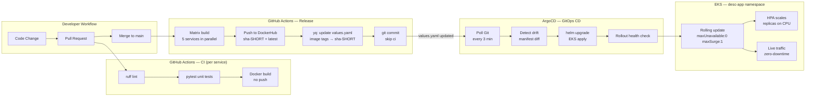

# CI/CD & GitOps Pipeline

## Pipeline Overview



## Workflow Files

| File | Trigger | Purpose |
|------|---------|---------|
| `.github/workflows/ci-gateway.yml` | push/PR to `app/gateway/**` | lint + test + docker build |
| `.github/workflows/ci-user-service.yml` | push/PR to `app/user-service/**` | lint + test + docker build |
| `.github/workflows/ci-records-service.yml` | push/PR to `app/records-service/**` | lint + test + docker build |
| `.github/workflows/ci-notification-service.yml` | push/PR to `app/notification-service/**` | lint + test + docker build |
| `.github/workflows/ci-frontend.yml` | push/PR to `app/frontend/**` | lint + test + docker build |
| `.github/workflows/release.yml` | push to `main` (any `app/**` or `helm/**` change) | build all → push DockerHub → update Helm values → ArgoCD auto-sync |

## CI Workflow Structure (per service)

Each service workflow has two jobs:

```
lint-and-test
  ├── checkout
  ├── setup-python 3.11 (pip cache)
  ├── pip install requirements + ruff + pytest
  ├── ruff check .
  └── pytest tests/ -v

docker-build (needs: lint-and-test)
  ├── checkout
  └── docker/build-push-action (push: false, tags: <service>:ci)
```

## Release Workflow Detail

```yaml
# .github/workflows/release.yml (condensed)

jobs:
  build-and-push:
    strategy:
      matrix:
        include:
          - { service: gateway,              image: desc-gateway }
          - { service: user-service,         image: desc-user-service }
          - { service: records-service,      image: desc-records-service }
          - { service: notification-service, image: desc-notification-service }
          - { service: frontend,             image: desc-frontend }

    steps:
      - docker/metadata-action  # tags: sha-<7char>, latest
      - docker/login-action     # DockerHub
      - docker/build-push-action
          push: true
          cache-from/to: gha (per-service scope)

  update-helm-values:
    needs: build-and-push
    steps:
      - checkout (token: GITHUB_TOKEN, fetch-depth: 0)
      - compute SHORT_SHA=$(echo $GITHUB_SHA | cut -c1-7)
      - install yq (mikefarah/yq)
      - yq -i ".gateway.image.tag = \"sha-${SHORT_SHA}\""  values.yaml
        # ... same for all 5 services + global.imageRegistry
      - git commit -m "chore(release): bump image tags [skip ci]"
      - git push
```

## Image Tagging Strategy

| Tag | Example | Used by |
|-----|---------|---------|
| `sha-<7char>` | `sha-a1b2c3d` | Helm values.yaml (pinned, reproducible) |
| `latest` | `latest` | Docker Compose local dev (always newest) |

The short SHA ties every running pod to an exact Git commit, making rollback trivial:

```bash
# Find which commit a pod is running
kubectl get deploy desc-webapp-gateway -n desc-app \
  -o jsonpath='{.spec.template.spec.containers[0].image}'
# → docker.io/myorg/desc-gateway:sha-a1b2c3d

# Roll back ArgoCD to the previous sync revision
argocd app rollback desc-webapp
```

## ArgoCD Application Manifest

File: `argocd/apps/desc-webapp.yaml`

```yaml
apiVersion: argoproj.io/v1alpha1
kind: Application
metadata:
  name: desc-webapp
  namespace: argocd
spec:
  project: desc-project
  source:
    repoURL: https://github.com/your-org/desc-cloudnative-demo
    targetRevision: main
    path: helm/desc-webapp
  destination:
    server: https://kubernetes.default.svc
    namespace: desc-app
  syncPolicy:
    automated:
      prune: true
      selfHeal: true
    syncOptions:
      - CreateNamespace=true
      - ServerSideApply=true
    retry:
      limit: 5
      backoff: { duration: 5s, factor: 2, maxDuration: 3m }
  ignoreDifferences:
    - group: apps
      kind: Deployment
      jsonPointers: [/spec/replicas]
    - group: autoscaling
      kind: HorizontalPodAutoscaler
      jsonPointers: [/spec/minReplicas, /spec/maxReplicas]
```

> `ignoreDifferences` on HPA prevents ArgoCD from showing false drift when the HPA adjusts replica counts during load.

## Secrets Required

Add these as GitHub Actions repository secrets:

| Secret | Description |
|--------|-------------|
| `DOCKERHUB_USERNAME` | DockerHub account username |
| `DOCKERHUB_TOKEN` | DockerHub access token (read/write) |
| `GITHUB_TOKEN` | Built-in, no setup needed — used for values.yaml commit |

## Deployment Strategy

| Setting | Value | Reason |
|---------|-------|--------|
| `strategy.type` | `RollingUpdate` | Zero-downtime deploys |
| `maxUnavailable` | `0` | Never reduce serving capacity mid-rollout |
| `maxSurge` | `1` | Add one pod before removing one (cost control) |
| `minReadySeconds` | `10` | Pod must be stable for 10 s before rollout continues |
| Liveness probe | `GET /health` | Restart pods that hang |
| Readiness probe | `GET /ready` | Gate traffic until DB/Redis connections are live |

## Rollback Runbook

```bash
# Option 1 — ArgoCD UI or CLI
argocd app history desc-webapp          # list previous sync revisions
argocd app rollback desc-webapp <id>    # revert to that revision

# Option 2 — Revert the values.yaml commit and push
git revert HEAD                         # reverts the [skip ci] commit
git push                                # ArgoCD detects change → syncs old tag

# Option 3 — Helm directly (emergency)
helm rollback desc-webapp -n desc-app
```
