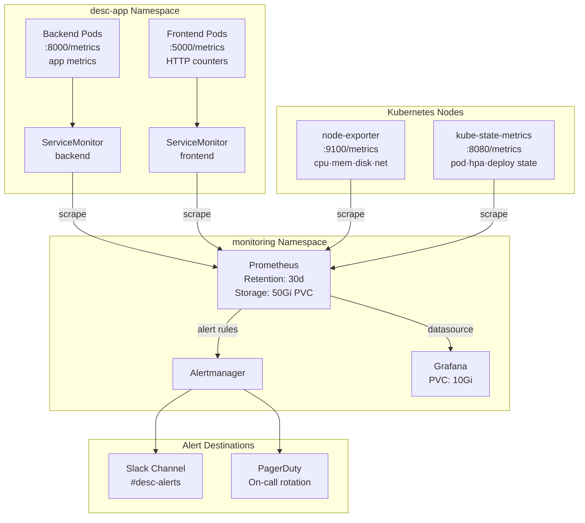

# Monitoring & Observability Architecture

## Stack Components

| Component | Role |
|-----------|------|
| Prometheus | Metrics scraping and storage (30d retention) |
| Grafana | Dashboards — USE metrics, HPA scaling, app health |
| Alertmanager | Alert routing → Slack / PagerDuty |
| node-exporter | Node-level CPU/Memory/Disk/Network metrics |
| kube-state-metrics | Kubernetes object state (HPA, Deployments, Pods) |
| metrics-server | HPA data source (live CPU/memory) |
| ServiceMonitor | CRD telling Prometheus which pods to scrape |

## Observability Architecture



## USE Methodology Dashboard

The **USE** framework (Brendan Gregg) evaluates every resource on three dimensions:

| Dimension | Definition | Example Metric |
|-----------|-----------|----------------|
| **U**tilization | % of time the resource is busy | CPU usage / limit |
| **S**aturation | Amount of extra work queued | CPU throttle %, pending pods |
| **E**rrors | Count of error events | HTTP 5xx, OOM kills, pod restarts |

### Grafana Dashboard Panels

```
Row 1: UTILIZATION
├── CPU Utilization % per pod          (rate(container_cpu_usage_seconds_total[5m]) / kube_pod_container_resource_limits_cpu_cores)
├── Memory Utilization % per pod       (container_memory_working_set_bytes / kube_pod_container_resource_limits_memory_bytes)
├── Network TX Throughput (MB/s)       (rate(container_network_transmit_bytes_total[5m]))
└── Network RX Throughput (MB/s)       (rate(container_network_receive_bytes_total[5m]))

Row 2: SATURATION
├── CPU Throttling %                   (rate(container_cpu_cfs_throttled_periods_total[5m]) / rate(container_cpu_cfs_periods_total[5m]))
├── HPA Current vs Desired Replicas    (kube_horizontalpodautoscaler_status_current_replicas vs desired_replicas)
├── Pending Pods                       (kube_pod_status_phase{phase="Pending"})
└── P95 Request Latency (ms)           (histogram_quantile(0.95, rate(http_request_duration_seconds_bucket[5m])))

Row 3: ERRORS
├── HTTP 5xx Error Rate (req/s)        (rate(http_requests_total{status=~"5.."}[5m]))
├── HTTP 4xx Error Rate (req/s)        (rate(http_requests_total{status=~"4.."}[5m]))
├── Pod Restart Rate                   (rate(kube_pod_container_status_restarts_total[15m]))
└── DB Query Error Rate                (rate(db_query_duration_seconds_count{status="error"}[5m]))

Row 4: APPLICATION BUSINESS METRICS
├── Requests per Second (total)        (rate(http_requests_total[1m]))
├── Cache Hit Rate %                   (rate(cache_hits_total[5m]) / (rate(cache_hits_total[5m]) + rate(cache_misses_total[5m])))
├── Active DB Connections              (db_connections_active)
└── Items Created (last 1h)           (increase(items_created_total[1h]))
```

## Alert Rules

```yaml
# High CPU — sustained over 5 minutes
- alert: HighCPUUtilization
  expr: |
    (rate(container_cpu_usage_seconds_total{namespace="desc-app"}[5m])
     / on(pod, container) kube_pod_container_resource_limits{resource="cpu", namespace="desc-app"}) > 0.80
  for: 5m
  labels: { severity: warning }

# HPA maxed out — cannot scale further
- alert: HPAAtMaxReplicas
  expr: |
    kube_horizontalpodautoscaler_status_current_replicas
      == kube_horizontalpodautoscaler_spec_max_replicas
  for: 10m
  labels: { severity: critical }

# Pod restart loop
- alert: PodRestartLoop
  expr: rate(kube_pod_container_status_restarts_total{namespace="desc-app"}[15m]) > 0.2
  for: 5m
  labels: { severity: warning }

# High HTTP error rate
- alert: HighHTTPErrorRate
  expr: |
    rate(http_requests_total{status=~"5..",namespace="desc-app"}[5m])
     / rate(http_requests_total{namespace="desc-app"}[5m]) > 0.01
  for: 5m
  labels: { severity: critical }
```

## Install Commands (Quick Reference)

```bash
# 1. Install kube-prometheus-stack
helm repo add prometheus-community https://prometheus-community.github.io/helm-charts
helm repo update
helm install kube-prometheus-stack prometheus-community/kube-prometheus-stack \
  --namespace monitoring --create-namespace \
  -f monitoring/prometheus/kube-prometheus-stack-values.yaml

# 2. Import Grafana dashboard
# In Grafana UI → Dashboards → Import → Upload JSON
# File: monitoring/grafana/dashboards/use-metrics-dashboard.json

# 3. Port-forward Grafana (local access)
kubectl port-forward svc/kube-prometheus-stack-grafana 3000:80 -n monitoring
# Default credentials: admin / prom-operator (change on first login)
```
